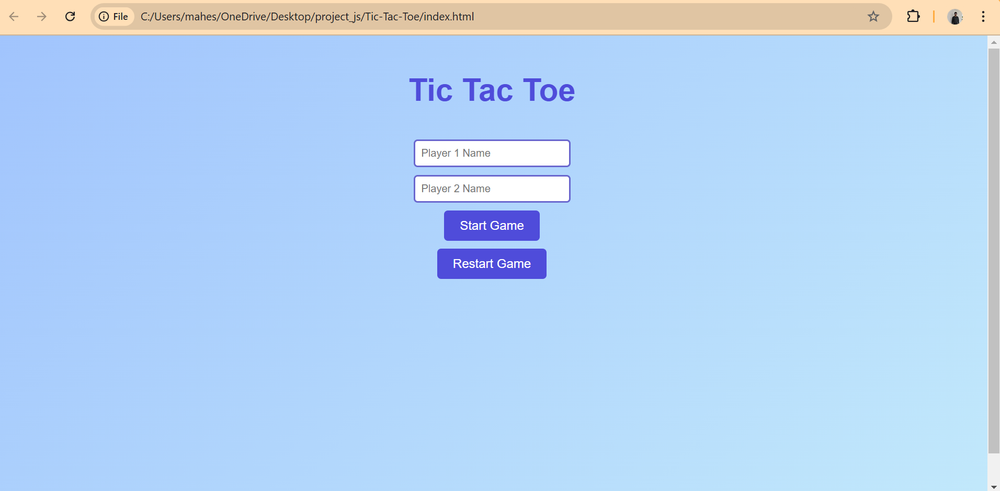
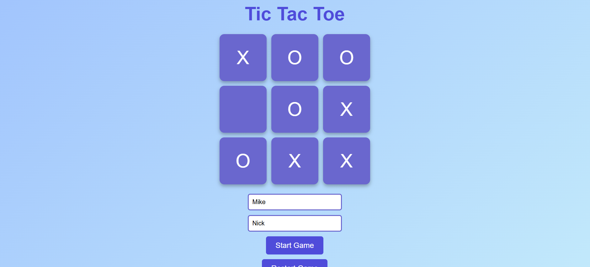

Tic Tac Toe Game 🎮
A simple and interactive Tic Tac Toe game built using HTML, CSS, and JavaScript. This project focuses on structuring the game logic with minimal global code and leveraging modern JavaScript concepts like factories and modules to ensure clean, modular, and maintainable code.

Features ✨
Player vs Player Mode: Two players can play on the same device.
Dynamic Game Board: The game board updates dynamically as players take turns.
Winner Detection: The game automatically checks for a winner or a draw after each move.
Responsive Design: The layout adjusts to various screen sizes for an optimal user experience.
Reset Functionality: A reset button allows players to start a new game.

Technologies Used 🛠️
HTML: Structure and layout of the game board.
CSS: Styling for the game board, buttons, and responsive design.
JavaScript: Game logic, event handling, and DOM manipulation.

How to Play 🕹️
Clone or download the repository.
Open the index.html file in your browser.
Players take turns clicking on empty squares to place their mark (X or O).
The game ends when one player aligns three marks horizontally, vertically, or diagonally, or if the board is full (resulting in a draw).

Project Goals 🎯
Practice modular JavaScript concepts like factories and modules.
Enhance understanding of DOM manipulation and event handling.
Build a responsive and user-friendly web application.

Future Enhancements 🚀
Add Player vs Computer Mode with adjustable difficulty.
Include customizable player names and themes.
Maintain a scoreboard to track wins, losses, and draws.

Output:

